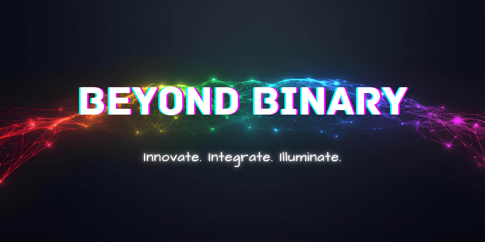

## 🎯 Vision

Beyond Binary is built on the belief that the most meaningful solutions exist in the spaces between extremes; beyond yes and no, beyond good and bad, beyond binary choices. This philosophy guides how I wish to live and work.

This business serves as my path to financial independence through website design and development, while staying rooted in what matters: creating work that supports causes such as animal welfare, human rights, environmental sustainability, and community wellbeing.

As Beyond Binary grows, success means more than financial stability. It means capacity for pro-bono work that makes a difference, opportunities to share knowledge through community education, and the freedom to keep learning how to be a better steward of our world. This repository exists as a reminder of that commitment - a compass to return to when the work gets hard or when success tempts me to forget why I started.

## 📖 About This Repository

This repository serves as the central hub for all Beyond Binary work, using git submodules to organize the individual projects while keeping them in their own repositories. This stucture allows each project to maintain its own history and documentation while staying connected to the broader Beyond Binary vision.

## 📁 Repository Structure

**`/personal_projects`** - Individual learning journeys and experimental projects. Each new coding concept or technology gets explored here through hands-on building. These projects serve both as skill development and as a growing library of reference implementations.

**`/client_projects`** - Paid website design and development work for clients. Each project maintained as its own submodule with full documentation.

**`/community_work`** - Pro-bono projects for mission-aligned organizations. Each project maintained as its own submodule with full documentation.

**`/resources`** - Reusable tools, learning references, and building blocks: coding language setups, algorithm implementations across different languages, templates, design systems, and other resources that support both learning and efficiency across all projects.

## 🚀 Current Highlights

### Tech Education Blog
A comprehensive blog platform that goes beyond traditional tech writing:
- **Genre-Based Organization**: Content categorized by interest areas (tech, lifestyle, creativity)
- **AI-Assisted Development**: Built using Amazon Q CLI for enhanced productivity
- **Responsive Design**: Modern, accessible interface with unique styling per genre
- **SEO Optimized**: Built for discoverability and performance

**Technologies**: Next.js, TypeScript, Tailwind CSS, Vercel-ready deployment

## 🌟 The Beyond Binary Philosophy

Every project in this repository reflects the core belief that the most interesting solutions exist in the nuanced spaces between extremes. Whether it's:

- **Technology & Humanity** - Building tools that enhance rather than replace human creativity
- **Structure & Flexibility** - Creating organized systems that adapt and evolve
- **Learning & Teaching** - Sharing knowledge while continuously growing
- **Individual & Community** - Personal growth that contributes to collective advancement

## 🔮 What's Next

This repository will continue to evolve as a living showcase of the Beyond Binary approach to problem-solving, creativity, and innovation. Future additions will span:

- **Client Solutions** - Custom applications and digital experiences
- **Educational Resources** - Tutorials, guides, and learning materials
- **Creative Experiments** - Artistic and technical boundary-pushing projects
- **Community Tools** - Open-source contributions and collaborative platforms

---

*Beyond Binary is more than a brand—it's a commitment to exploring the infinite possibilities that exist when we move beyond simple binary thinking.*
