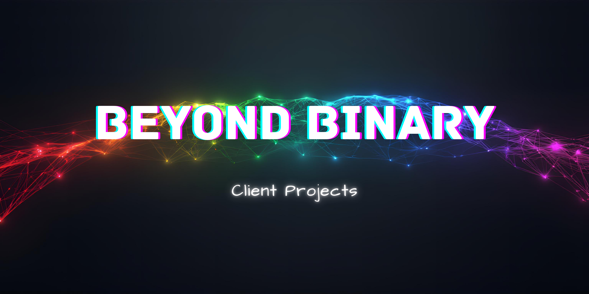

## 📖 About This Directory

This directory houses paid client work for Beyond Binary. Each project here represents a partnership with businesses and organizations seeking to build or enhance their online presence. These projects reflect the growth of Beyond Binary as a sustainable business while maintaining a commitment to quality, thoughtful design, and values in aligned work.

Client work is where Beyond Binary's vision meets real world impact, creating digital solutions that serve others while building the foundation for financial independence and future community contributions.

## 📁 Directory Structure

Projects are organized by business or project name. As the directory grows, additional subdirectories may be added for easier navigation. Each client project is maintained as its own submodule with complete documentation and version control.

---

*Building sustainable business is not just about closing the sale as much as it is about fostering a partnership.*