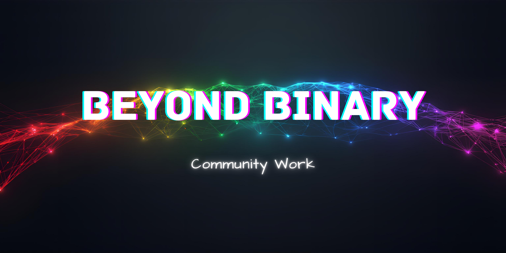

## 📖 About This Directory

This directory houses pro-bono projects for mission-aligned organizations and causes I deeply care about such as; animal welfare, human rights, environmental sustainability, and community well-being. Each project here represents a commitment to using my skills to support work that matters beyond financial gain.

Community work is central to the Beyond Binary vision: building a sustainable business means creating capacity to give back. These projects serve organizations doing important work, often with limited resources for professional web presence and digital tools.

## 📁 Directory Structure

As this directory groes, projects will be organized to make navigation easier. For now, each pro-bono project lives here as its own submodule, representing partnerships with non-profits, animal rescues, grassroots organizations, and community initiatives working toward a better world.

---

*Not all who wander are lost.*