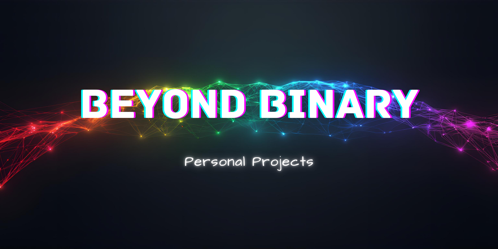

## 📖 About This Directory

This directory houses my personal projects that fall under the Beyond Binary umbrella. It serves as a guiding path to remind me of the goals I want to achieve. These projects fuel my journey as a developer and lay the foundations for building Beyond Binary into a sustainable business.

This is where curiosity lives, where frustration turns into breakthroughs, and where each commit represents progress.

## 📁 Directory Structure

**`/business`** - Projects related to building Beyond Binary as a brand and business. Projects like the business website, beyond binary blog, and branding materials.

**`/oracle`** -Oracle certification study tools, exam preparation projects, and learning materials organized by certification path.

**`/ recipes`** - Recipe collection and culinary experiments, serving as content for future blog projects and personal reference.

---

*Where attention goes, energy flows.*