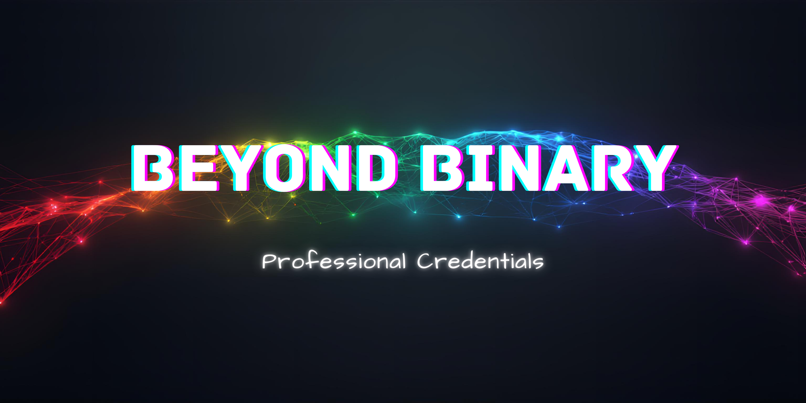

## 📖 About This Directory

This directory houses professional and career-related documents including resumes, cover letters, and professional certifications. Keeping these in this directory ensures they are version controlled, backed up, and accessible whenever needed.

## 📁 Directory Structure

**`/resumes`** - Current and archived resume version. Organized by date or purpose.

**`/cover-letters`** - Cover letter templates and customized versions for specific applications or opportunities.

**`/professional-certificates`** - Certifications, course completions, and professional credentials earned throughout my development journey and career.

---

*A jack of all trades is a master of none, but oftentimes better than a master of one.*