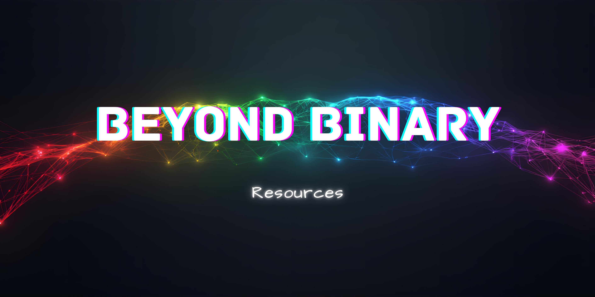

## 📖 About This Directory

This directory serves as a personal library of reusable code, reference implementations, and project foundations. Resources here are built once to use for future adaptations in an effort to save time, ensure consistency, and capture lessons learned across projects.
These resources support both learning and production work, providing quick-start templates, battle-tested algorithms, and proven component patterns that can be referenced or copied into new projects as needed.

## 📁 Directory Structure

**`/algorithms`** - Algorithm implementations across differennt programming languages. Organized by language using subdirectories

**`/project-starters`** - Starter templates and boilerplate setups for different frameworks, languages, and technology stacks. Organized by language or framework using subdirectories

**`components`** - Reusable UI components and design system elements. Organized by language or framework using subdirectories

## How to Use These Resources

**Algorithms** - Copy the implementation when you need that specific solution, then adapt to your use case.

**Project Starters** - Clone or copy as the foundation for a new project.

**Components** - Reference or copy components into your projects, customizing as needed for specific requirements.

These are reference implementations and starting points. Copy, adapt, and iterate based on each project's needs.

---

*Building a library of proven solutions; one resource, one failure, one success, and one brick at a time*